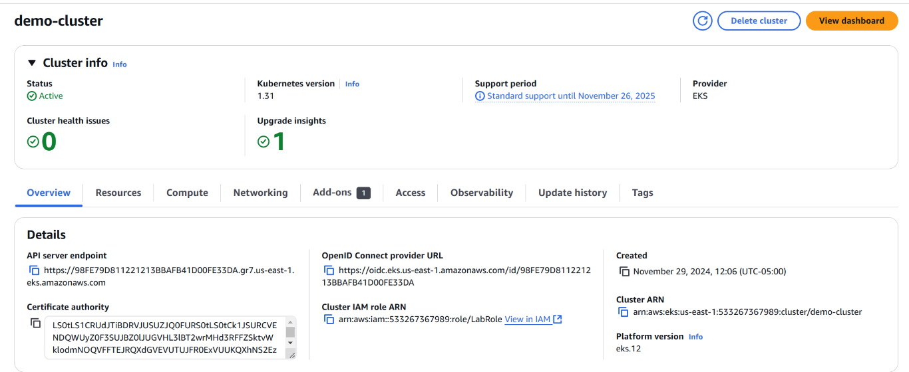

## K8s on AWS EKS

### Create Cluster and Nodes on AWS



### 01.- Create the Namespace demo-k8s
```
kubectl apply -f demo-k8s-ns.yaml
``` 

### 02.- Create the context
```
kubectl config set-context demo-k8s-context --namespace=demo-k8s --cluster=arn:aws:eks:us-east-1:533267367989:cluster/demo-cluster --user=arn:aws:eks:us-east-1:533267367989:cluster/demo-cluster
```

### 03.- Switch to the created context
```
kubectl config use-context demo-k8s-context
```

### 04.- Create StorageClass for dynamic volume provisioning (optional)
```
kubectl apply -f demo-k8s-sc.yaml
```

### 05.- Execute configuration files (YAML)
***Scenario 01) Node-level volume persistence (hostPath)***
```
kubectl apply -f mongodb-deploy.yaml -f mongodb-svc.yaml -f webserver-deploy.yaml -f webserver-svc.yaml

kubectl delete -f mongodb-deploy.yaml -f mongodb-svc.yaml -f webserver-deploy.yaml -f webserver-svc.yaml
```
***Scenario 02) Volume persistence with PVC using EBS storage***
```
kubectl apply -f mongodb-pv.yaml -f mongodb-pvc.yaml -f mongodb-deploy-pvc.yaml -f mongodb-svc.yaml -f webserver-deploy.yaml -f webserver-svc.yaml

kubectl delete -f mongodb-pv.yaml -f mongodb-pvc.yaml -f mongodb-deploy-pvc.yaml -f mongodb-svc.yaml -f webserver-deploy.yaml -f webserver-svc.yaml
```
***Scenario 03) Dynamic EBS volume persistence --> Step 04 must be executed first***
```
kubectl apply -f mongodb-pvc-dynamic.yaml -f mongodb-deploy-pvc.yaml -f mongodb-svc.yaml -f webserver-deploy.yaml -f webserver-svc.yaml

kubectl delete -f mongodb-pvc-dynamic.yaml -f mongodb-deploy-pvc.yaml -f mongodb-svc.yaml -f webserver-deploy.yaml -f webserver-svc.yaml
```

### 06.- Create Database and Collection in MongoDB (this action is performed only once)

Open an interactive MongoDB Shell (mongosh) session inside the `mongodb` pod
```
kubectl exec -it <pod-mongodb> -- mongosh

kubectl exec -it mongodb-55bc6d8899-rxvkq -- mongosh

use myDB
db.createCollection("countries")
db.countries.insertMany([
   { name: 'United States', gdp: 21137518 },
   { name: 'China', gdp: 14140163 },
   { name: 'Japan', gdp: 5081770 },
   { name: 'Germany', gdp: 3845630 },
   { name: 'Ecuador', gdp: 2507666 }
])
```
